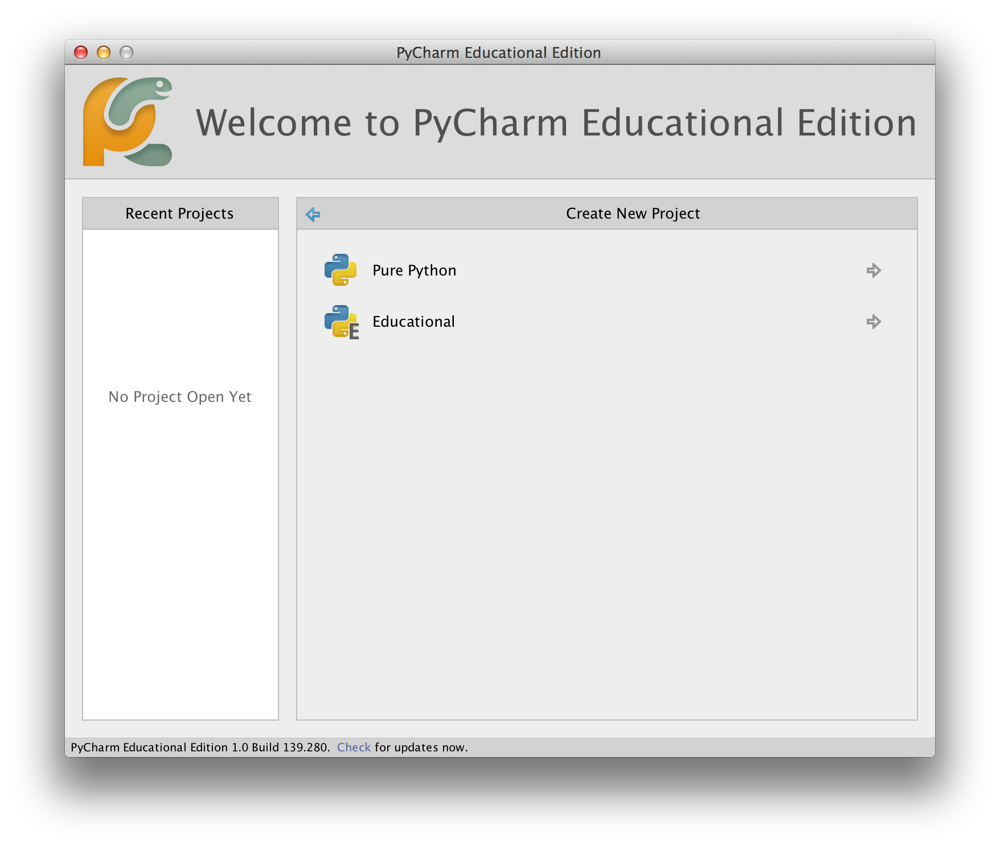

# Первые шаги

Давайте посмотрим, как создать традиционную программу 'Hello World' на Python. Это научит вас писать, сохранять и выполнять программы на Python.

Существует два способа запуска программ на Python: использование интерактивного приглашения интерпретатора и использование файла с текстом программы. Сейчас мы увидим, как пользоваться обоими методами.

## Использование командной строки интерпретатора

Откройте окно терминала (как было описано в главе [Установка](./installation.md#installation)) и запустите интерпретатор Python, введя команду `python3` и нажав `[enter]`.

После запуска Python вы должны увидеть `>>>`, где можно начать набирать текст. Это называется _командная строка интерпретатора Python_.

В командной строке интерпретатора Python введите:

```python
print("Hello World")
```

после чего нажмите клавишу `[enter]`. В результате должны появиться слова `Hello World`.

Вот пример того, что вы должны увидеть, при использовании компьютера с Mac OS X. Детали программного обеспечения Python будут отличаться в зависимости от вашего компьютера, но часть от подсказки (т.е. от `>>>` и далее) должна быть одинаковой независимо от операционной системы.

<!-- Вывод должен соответствовать переменной pythonVersion в book.json -->
```python
$ python3
Python 3.6.0 (default, Jan 12 2017, 11:26:36)
[GCC 4.2.1 Compatible Apple LLVM 8.0.0 (clang-800.0.38)] on darwin
Type "help", "copyright", "credits" or "license" for more information.
>>> print("Hello World")
Hello World
```

Обратите внимание, что Python выдаёт результат работы строки немедленно! Вы только что ввели одиночный _оператор_ Python. `print` используется для того, чтобы (что неудивительно) напечатать любое переданное в него значение. В данном случае мы передали в него текст `Hello World`, который и был напечатан на экране.

### Как выйти из командной строки интерпретатора

Если вы используете GNU/Linux или оболочку OS X, вы можете выйти из командной строки интерпретатора нажатием `[ctrl + d]` или введя команду `exit()` (примечание: не забудьте написать скобки, `()`), а затем нажав клавишу `[enter]`.

Если вы используете командную строку Windows, нажмите `[ctrl + z]`, а затем нажмите клавишу `[enter]`.

## Выбор редактора

Поскольку мы не можем набирать программу в командной строке интерпретатора каждый раз, когда нам нужно что-то запустить, нам понадобится сохранять программы в файлах, чтобы потом иметь возможность запускать их сколько угодно раз.

Для создания программ на Python в файлах нам нужна программа-редактор, в которой можно набирать и сохранять текст. Хороший редактор облегчит вам жизнь при написании исходных файлов. Следовательно, выбор редактора действительно очень важен. Вы должны выбрать редактор, также как вы выбираете автомобиль, который будете покупать. Хороший редактор поможет вам легко писать программы на Python, сделает ваше путешествие более комфортным и поможет вам достичь пункта назначения (достичь цели) гораздо быстрее и безопаснее.

Одно из самых основных требований – это _подсветка синтаксиса_, когда разные элементы программы на Python раскрашены так, чтобы вы могли легко _видеть_ вашу программу и ход её выполнения.

Если вы не знаете, с чего начать, я бы рекомендовал использовать программу [PyCharm Educational Edition](https://www.jetbrains.com/pycharm-edu/), которая доступна для Windows, Mac OS X и GNU/Linux. Подробности в следующем разделе.

Если вы пользуетесь Windows, *Не используйте Блокнот* – это плохой выбор, поскольку он не обладает функцией подсветки синтаксиса, а также не позволяет автоматически вставлять отступы, что очень важно в нашем случае, как мы увидим позже. Хорошие редакторы делают это автоматически.

Опытные программисты, должно быть, уже используют [Vim](http://www.vim.org) или [Emacs](http://www.gnu.org/software/emacs/). Не стоит даже и говорить, что это два наиболее мощных редактора, и вы только выиграете от их использования для написания программ на Python. Лично я пользуюсь ими обоими для большинства своих программ, и даже написал [книгу о Vim]({{ book.vimBookUrl }}). 

Если вы готовы потратить время на изучение Vim или Emacs, то я настоятельно рекомендую вам решиться и потратить время на изучение Vim или Emacs, поскольку это будет приносить вам пользу долгие годы. Однако, как я уже писал выше, новички могут пока просто остановиться на PyCharm и сосредоточиться на изучении Python, а не текстового редактора.

Я повторюсь ещё раз: обязательно выберите подходящий редактор – это сделает написание программ на Python более простым и занимательным.

Если вас интересует подробное обсуждение этой темы, загляните в [Поиск идеального редактора кода Python](https://realpython.com/courses/finding-perfect-python-code-editor/).

## PyCharm {#pycharm}

[PyCharm Educational Edition](https://www.jetbrains.com/pycharm-edu/) - это бесплатный редактор, который можно использовать для написания программ на языке Python.

Когда вы откроете PyCharm, вы увидите следующее, нажмите на `Create New Project`:


Выберите `Pure Python`:



Измените `untitled` на `helloworld` в качестве местоположения проекта, вы должны увидеть детали, подобные этим:


Нажмите кнопку `Create`.

Щелкните правой кнопкой мыши на `helloworld` в боковой панели и выберите `New` -> `Python File`:


Вам будет предложено ввести имя, введите `hello`:


Теперь вы видите, что для вас открыт файл:


Удалите уже имеющиеся строки, а теперь введите следующее:

<!-- TODO: Update screenshots for Python 3 -->

```python
print("hello world")
```
Теперь щелкните правой кнопкой мыши на том, что вы набрали (не выделяя текст), и нажмите `Run 'hello'`.


Теперь вы должны увидеть вывод (то, что печатает программа) вашей программы:


Фух! Это было довольно много шагов для начала работы, но впредь, каждый раз, когда мы попросим вас создать новый файл, не забывайте просто щелкнуть правой кнопкой мыши на `helloworld` слева -> `New` -> `Python File` и продолжить те же шаги для ввода и запуска, как показано выше.

Более подробную информацию о PyCharm можно найти на странице [PyCharm Quickstart](https://www.jetbrains.com/pycharm-educational/quickstart/).

## Vim

1. Установите [Vim] (http://www.vim.org)
    * Пользователи Mac OS X должны установить пакет `macvim` через [HomeBrew](http://brew.sh/)
    * Пользователи Windows должны загрузить "самоустанавливающийся исполняемый файл" с [сайта Vim](http://www.vim.org/download.php)
    * Пользователи GNU/Linux должны получить Vim из репозиториев программного обеспечения своего дистрибутива, например, пользователи Debian и Ubuntu могут установить пакет `vim`.
2. Установите плагин [jedi-vim](https://github.com/davidhalter/jedi-vim) для автозаполнения.
3. Установите соответствующий python-пакет `jedi`: `pip install -U jedi`.

## Emacs

1. Установите [Emacs 24+](http://www.gnu.org/software/emacs/).
    * Пользователи Mac OS X должны получить Emacs с сайта http://emacsformacosx.com.
    * Пользователи Windows должны получить Emacs с http://ftp.gnu.org/gnu/emacs/windows/
    * Пользователи GNU/Linux должны получить Emacs из репозиториев программного обеспечения своего дистрибутива, например, пользователи Debian и Ubuntu могут установить пакет `emacs24`.
2. Установите [ELPY](https://github.com/jorgenschaefer/elpy/wiki)

## Использование программных файлов

А теперь давайте вернёмся к программированию. Существует такая традиция, что какой бы язык программирования вы ни начинали учить, первой вашей программой должна быть программа 'Hello World'. Это программа, которая просто выводит надпись 'Hello World'. Как сказал Simon Cozens[^1], это "традиционное заклинание богов программирования, которое поможет вам лучше изучить язык".

Запустите выбранный вами редактор, введите следующую программу и сохраните её под именем `hello.py`.

Если вы используете PyCharm, мы уже [обсуждали, как запускать из исходного файла](#pycharm).

Для других редакторов откройте новый файл `hello.py` и введите следующее:

```python
print("hello world")
```

Куда следует сохранить файл? В любую папку, расположение которой вам известно. Если вы не понимаете, что это значит, создайте новую папку и используйте это место для сохранения и запуска всех ваши программы на Python:

- `/tmp/py` в Mac OS X
- `/tmp/py` в GNU/Linux
- `C:\py` в Windows

Чтобы создать папку (для используемой вами операционной системы), воспользуйтесь командой `mkdir` в терминале. Например, `mkdir /tmp/py`.

ВАЖНО: Не забывайте указывать расширение файла `.py`. Например, `foo.py`.

Чтобы запустить вашу программу Python:

1. Откройте окно терминала (как это сделать, см. предыдущую главу [Установка](./installation.md#installation)).
2. Измените директорию на место сохранения файла, например, `cd /tmp/py` (cd - **C**hange **d**irectory).
3. Запустите программу, введя команду `python hello.py`. Вывод будет выглядеть так, как показано ниже.

```
$ python hello.py
hello world
```


Если у вас получился такой же вывод, поздравляю! – вы успешно выполнили вашу первую программу на Python. Вы только что совершили самый сложный шаг в обучении программированию, заключающийся в написании своей первой программы!

Если вы получите сообщение об ошибке, введите вышеуказанную программу в _точности_ так, как показано здесь, и запустите снова. Обратите внимание, что Python чувствительный к регистру, то есть `print` – это не то же самое, что `Print` (обратите внимание на букву `p` в нижнем регистре в первом случае и на букву `P` в верхнем регистре во втором). Также убедитесь, что перед первым символом в строке нет пробелов или символов табуляции – позже мы увидим, [почему это важно](./basics.md#indentation).

**Как это работает**

Программа на языке Python состоит из _выражений_. В нашей первой программе у нас только один оператор. В этом операторе мы вызываем _выражение_ `print`, в которое вводим текст "hello world".

## Получение помощи

Для быстрого получения информации о любой функции или операторе Python служит встроенная функция `help`. Это особенно удобно при использовании командной строки интерпретатора. К примеру, выполните `help('len')` – это покажет справку по функции `len`, которая используется для подсчета количества элементов.

Примечание: Для выхода из справки нажмите `q`.

Аналогичным образом можно получить информацию почти о чём угодно в Python. При помощи функции `help()` можно даже получить описание самой функции `help`!

Если вас интересует информация об операторах, как например, `return`, их необходимо указывать в кавычках (например, `help('return')`), чтобы Python понял, чего мы хотим.

## Резюме

Теперь вы умеете с лёгкостью писать, сохранять и запускать программы на Python.

И поскольку сейчас вы уже используете Python, давайте узнаем больше о его основных принципах.

---

[^1]: автор замечательной книги 'Начало работы с Perl'
